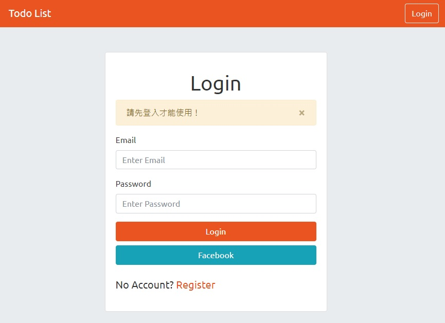

# Todo List with Sequelize

<br>
:sparkles: Record your todo list.  

## Features
* Account Management System
* Shows all todos on homepage.  
* You can create, edit, delete the todo info.

## Installation
* Install the Node.js, MySQL, MySQL Workbench and npm according to your OS(MacOS or Windows).
* Download the project to your local machine.
* Get into your project folder by Terminal and enter
  ```bash
  npm install
  ```

## How to use
* Create a .env file for yourself, refer to the .env.example for details
* If you need the seeder data enter
  ```bash
  npx sequelize db:seed:all
  ```
* Get start by enter
  ```bash
  npm run dev
  ```
  It's running when you see
  ```bash
  App is running on http://localhost:3000
  ```
* Open the browser, and enter the URL `http://localhost:3000`
* You can stop on Terminal by
  ```bash
  Ctrl + C
  ```

## Build with
* Node.js @14.16.0
* MySQL @8.0.15
